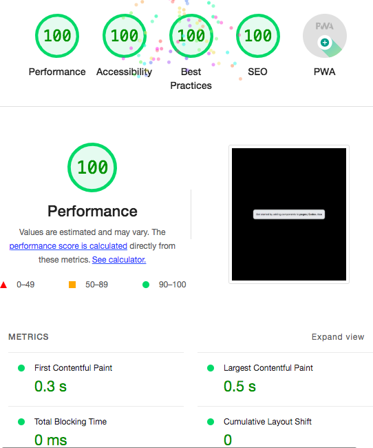

## Getting Started
Fully-black empty PWA template website with TypeScript. Frameworked by Next.js

"The emerging norm for web development is to build a React single-page application, with server rendering. 

The two key elements of this architecture are something like:
The main UI is built & updated in JavaScript using React or something similar. 
The backend is an API that that application makes requests against.

This idea has really swept the internet. It started with a few major popular websites and has crept into corners like marketing sites and blogs."

— Tom MacWright, https://macwright.com/2020/05/10/spa-fatigue.html

